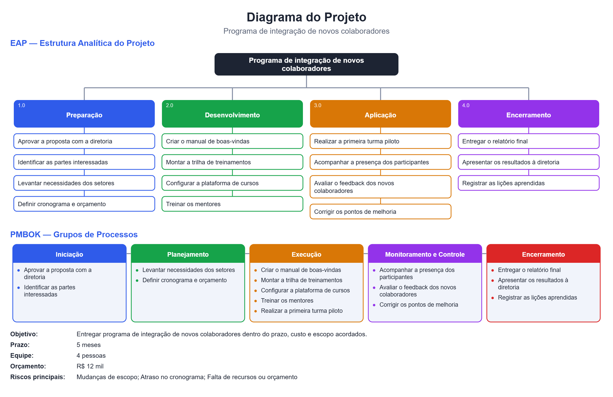

# Gerador de Diagrama de Projeto (PMBOK + EAP)

Descreva seu projeto em texto e receba uma **imagem com o diagrama completo**: a **EAP** (Estrutura Analítica do Projeto) e os 5 grupos de processos do **PMBOK**. Tudo roda no navegador, sem instalar nada e sem cadastro.

🔗 **Acesse o site:** https://carolhr.github.io/diagrama-pmbok/



## O que o site entrega

- **EAP:** o projeto no topo, as entregas (ou fases) e os pacotes de trabalho de cada uma.
- **Grupos de processos do PMBOK:** Iniciação, Planejamento, Execução, Monitoramento e Controle e Encerramento, com as etapas do seu projeto em cada grupo.
- **Resumo:** objetivo, prazo, equipe, orçamento e principais riscos.
- **Download:** botão para baixar o diagrama em PNG.

## Como usar

Escreva a descrição do projeto no campo de texto, clique em **Gerar diagrama** e, se quiser, em **Baixar imagem (PNG)**. Existem duas formas de descrever o projeto.

### Forma 1: uma frase com as funcionalidades

Liste as funcionalidades separadas por vírgula, depois da palavra **"com"**. Prazo, equipe e orçamento podem vir em frases soltas.

```
Aplicativo de delivery com cadastro de lojas, cardápio, pagamento online e painel de pedidos. Prazo de 6 meses, equipe de 5 pessoas, orçamento de R$ 50 mil.
```

### Forma 2: detalhando as fases

Use quando você já sabe as fases e as etapas de cada uma. O site monta o escopo completo e coloca cada etapa no lugar certo.

```
Projeto: Programa de integração de novos colaboradores
Prazo: 5 meses
Equipe: 4 pessoas
Orçamento: R$ 12 mil

Fase 1 - Preparação
- Aprovar a proposta com a diretoria
- Identificar as partes interessadas
- Levantar necessidades dos setores
- Definir cronograma e orçamento

Fase 2 - Desenvolvimento
- Criar o manual de boas-vindas
- Montar a trilha de treinamentos
- Configurar a plataforma de cursos
- Treinar os mentores

Fase 3 - Aplicação
- Realizar a primeira turma piloto
- Acompanhar a presença dos participantes
- Avaliar o feedback dos novos colaboradores
- Corrigir os pontos de melhoria

Fase 4 - Encerramento
- Entregar o relatório final
- Apresentar os resultados à diretoria
- Registrar as lições aprendidas
```

Esse texto gera o diagrama mostrado no topo desta página.

#### Como as etapas foram distribuídas nos grupos do PMBOK

| Grupo do PMBOK | Etapas que caem nele |
|---|---|
| Iniciação | Aprovar a proposta com a diretoria; Identificar as partes interessadas |
| Planejamento | Levantar necessidades dos setores; Definir cronograma e orçamento |
| Execução | Criar o manual de boas-vindas; Montar a trilha de treinamentos; Configurar a plataforma de cursos; Treinar os mentores; Realizar a primeira turma piloto |
| Monitoramento e Controle | Acompanhar a presença dos participantes; Avaliar o feedback dos novos colaboradores; Corrigir os pontos de melhoria |
| Encerramento | Entregar o relatório final; Apresentar os resultados à diretoria; Registrar as lições aprendidas |

A fase "Preparação" foi dividida entre Iniciação e Planejamento, porque cada etapa é classificada pelo seu verbo.

## Regras do formato por fases

- **Fases:** uma linha começando com `Fase:` ou `Fase 1 -`, seguida do nome da fase.
- **Etapas:** uma por linha, abaixo da fase, começando com `-`, `•` ou numeração (`1.`, `2)`).
- **Informações do projeto (opcional):** linhas `Projeto:`, `Prazo:`, `Equipe:` e `Orçamento:`. Quando não informadas, aparece "A definir".
- **Verbo no começo da etapa:** o site usa o verbo para escolher o grupo do PMBOK. Por exemplo, "Testar", "Validar" e "Avaliar" vão para Monitoramento e Controle; "Entregar" e "Encerrar" vão para Encerramento.

## Limites e cuidados

- O diagrama mostra no máximo **6 fases** e **6 etapas por fase**. O site avisa quando algo fica de fora.
- Se algum grupo do PMBOK ficar sem etapas, o site avisa e mostra "Nenhuma etapa informada" naquele quadro.
- O site **não usa inteligência artificial**: ele decide pelas palavras-chave. Se uma etapa for para um grupo diferente do esperado, troque o verbo do começo (por exemplo, "Validar" em vez de "Realizar").
- Na Forma 1, evite a palavra "com" antes da lista e evite "e" dentro de um item. Use vírgulas para separar os itens.
- Tudo é processado no seu navegador, mas evite incluir dados pessoais ou sigilosos no texto.

## Tecnologias

HTML, CSS e JavaScript puro, sem bibliotecas e sem servidor. O diagrama é desenhado em SVG e convertido em PNG pelo próprio navegador.

## Estrutura do projeto

```
diagrama-pmbok/
├── index.html      # página do site
├── style.css       # estilos
├── script.js       # leitura da frase, desenho do diagrama e botões
├── fases.js        # leitura do formato por fases e classificação no PMBOK
├── favicon.svg     # ícone do site
├── img/
│   └── diagrama-exemplo.png
└── README.md
```

## Rodar no seu computador

Baixe os arquivos e abra o `index.html` no navegador. Não precisa instalar nada.
